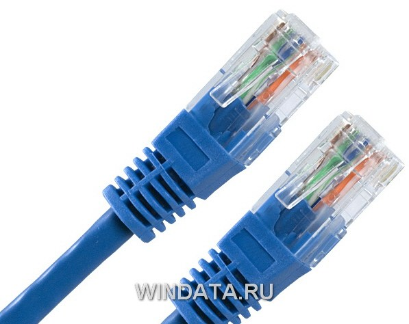
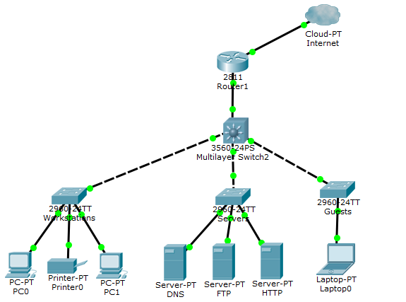

---
## Front matter
lang: ru-RU
title: Архитектура и организация локальных сетей
subtitle: Операционные системы
author:
  - Маркеш Виейра Нанке Грасимилде
institute:
  - Российский университет дружбы народов, Москва, Россия
date:
  - 15.04.2026

## i18n babel
babel-lang: russian
babel-otherlangs: english

## Formatting pdf
toc: false
toc-title: Содержание
slide_level: 2
aspectratio: 169
section-titles: true
theme: metropolis
header-includes:
 - \metroset{progressbar=frametitle,sectionpage=progressbar,numbering=fraction}
---

# Информация

## Докладчик

  * Маркеш Виейра Нанке Грасимилде
  * студент группы НКАбд-05-25
  * Российский университет дружбы народов
  * 1032255356@rudn.ru

# Актуальность темы

Актуальность моего доклада обусловлена ростом использования компьютерных сетей в учебных заведениях, офисах и жилых домах. Неправильная архитектура и организация локальных сетей могут привести к потере данных, снижению производительности и уязвимостям безопасности.

# Объект и предмет исследования

Объект исследования: локальные сети (LAN) и их инфраструктура.

Предмет исследования: методы архитектуры и организации LAN, включая топологии, устройства, протоколы, среды передачи, VLAN и безопасность.

# Цель работы

Изучить основные методы архитектуры и организации локальных сетей (LAN) и способы их применения в современных условиях: учебные классы, офисы, малые предприятия.

# Задачи

    Изучить физические и логические топологии.

    Проанализировать проводные и беспроводные среды передачи.

    Понять функции коммутатора, маршрутизатора и точки доступа.

    Изучить IP-адресацию и протокол Ethernet.

    Исследовать VLAN и безопасность в LAN.

    Представить практический пример проекта LAN.

# Введение

Локальные сети (LAN) соединяют устройства на ограниченной территории с высокими скоростями (100 Мбит/с – 10 Гбит/с). Архитектура – это логический проект сети, а организация – физическая реализация: кабели, оборудование и настройки.

# Физические топологии

Существуют три основных типа физических топологий:

 Звезда – все устройства подключены к центральному коммутатору.

 Шина – один общий кабель (устарела).

 Кольцо – данные передаются по кругу.

Топология Преимущество	Недостаток
Звезда;	Изолированный отказ;Больше кабелей
Шина;	  Мало кабеля;	  Полный отказ при обрыве
Кольцо;	Предсказуемость;Отказ одного влияет на всех

{#fig:002 width=70%} 

# Среды передачи

Проводные среды:  Витая пара (Cat5e/Cat6) – до 100 м, 1-10 Гбит/с.

 Оптоволокно – большие расстояния, высокая скорость.

Беспроводные среды: Wi-Fi (802.11n/ac/ax) – дальность 30–100 м.

Среда	 Скорость	 Расстояние
Cat5e;	1 Гбит/с;	 100 м
Cat6;	10 Гбит/с;	 55-100 м
Оптоволокно;10-100 Гбит/с;	до 550 м

{#fig:003 width=70%}

# Основные устройства

    Коммутатор (switch) – соединяет устройства в одной LAN, используя MAC-адреса.

    Маршрутизатор (router) – связывает разные сети, используя IP-адреса.

    Точка доступа (AP) – преобразует Ethernet в Wi-Fi.

{#fig:004 width=70%}

# P-адресация и маски подсети

IPv4 имеет длину 32 бита и записывается четырьмя десятичными числами, например 192.168.1.10. Маска подсети определяет, сколько устройств может быть в сети:

    Маска /24 (255.255.255.0) – 254 хоста.

    Маска /25 (255.255.255.128) – 126 хостов.

    Маска /16 (255.255.0.0) – 65 534 хостов.

Маршрутизатор использует маску, чтобы понять, находится ли адресат в той же сети (прямая доставка) или в другой (пересылка через другой роутер).

# VLAN (виртуальные локальные сети)

VLAN (Virtual LAN) позволяет разделить один физический коммутатор на несколько логически изолированных сетей.

Преимущества VLAN:

    Безопасность (трафик не просачивается между VLAN).

    Снижение широковещательного трафика.

    Гибкость при реорганизации сети.

Пример: VLAN 10 – отдел кадров (порты 1-5), VLAN 20 – IT отдел (порты 6-10).

# Безопасность в LAN

    Фильтрация по MAC – список разрешённых адресов.

    Port security – ограничение количества MAC-адресов на порту.

    Wi-Fi: используйте WPA2 или WPA3, отключите WPS.

    Меняйте пароли по умолчанию (admin/admin).

    Регулярно обновляйте прошивку оборудования.

# иагностика неисправностей

Частые проблемы и их причины:

    Нет соединения → повреждённый кабель.

    Медленная работа → старый хаб или перегрузка сети.

    Конфликт IP → два устройства с одинаковым IP-адресом.

Инструменты диагностики:

    ping – проверка соединения.

    ipconfig (Windows) / ifconfig (Linux) – просмотр IP и MAC.

    tracert – трассировка маршрута до адресата.

    arp -a – просмотр таблицы MAC-адресов.

Многие простые проблемы решаются перезагрузкой роутера и коммутатора.

# Пример проекта: учебный класс

Спроектируем сеть для учебного класса с 25 стационарными компьютерами, одним сетевым принтером и Wi-Fi-доступом для до 15 телефонов или ноутбуков.

Компоненты:

    1 роутер.

    2 коммутатора Gigabit на 16 портов.

    1 точка доступа Wi-Fi 6.

    Кабель Cat6 для всех стационарных подключений.

Настройка IP:

    Диапазон: 192.168.0.0/24.

    DHCP: раздаёт адреса от 192.168.0.100 до 192.168.0.200.

    Принтер: статический IP 192.168.0.50.

    Топология: звезда.

{#fig:008 width=70%}

#  Преимущества хорошей архитектуры LAN

    Производительность: коммутаторы Gigabit устраняют узкие места, топология звезда исключает коллизии.

    Надёжность: типичная задержка между устройствами на одном коммутаторе составляет менее 1 миллисекунды.

    Расширение: коммутаторы с запасными портами позволяют легко добавлять новые устройства.

    Обслуживание: маркированные кабели и организация в стойке сокращают время диагностики.

    Безопасность: VLAN и port security защищают сеть от несанкционированного доступа.

# Заключение

Безопасность и эффективность локальных сетей зависят от хорошей архитектуры (топологии, протоколы, адресация) и надлежащей физической организации (устройства, кабели, стойка, патч-панель). Постоянное развитие новых угроз требует регулярных обновлений защитных механизмов.

# Выводы

В ходе данной работы я изучила: Физические (звезда, шина, кольцо) и логические (широковещательная, передача маркера) топологии.Проводные (витая пара, оптоволокно) и беспроводные (Wi-Fi) среды передачи.Функции основных устройств: коммутатора, маршрутизатора и точки доступа.
Основы IP-адресации, масок подсети и протокола Ethernet. Концепцию VLAN и её преимущества для безопасности и производительности.
Базовые практики безопасности и инструменты диагностики.Практический пример проекта LAN для учебного класса.

Теперь я понимаю, что локальная сеть – это гораздо больше, чем просто «подключить компьютеры кабелями». Архитектура определяет логический проект, а организация занимается физической реализацией – и обе одинаково важны для эффективной, безопасной и простой в обслуживании сети.

