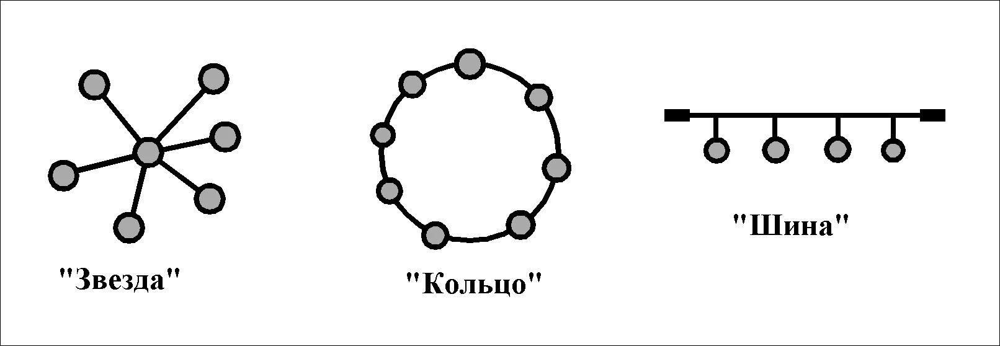
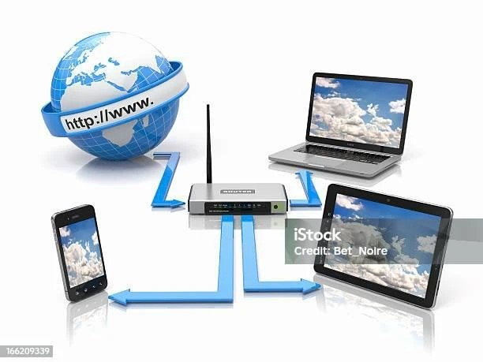
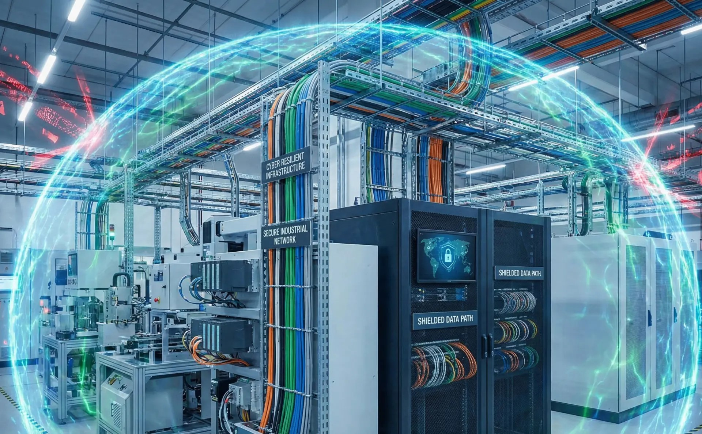

---
## Front matter
title: "Доклад на тему: Архитектура и организация локальных сетей "
subtitle: "Архитектура компьютеров и операционные системы"
author: "Маркеш Виейра Нанке Грасимилде"

## Generic otions
lang: ru-RU
toc-title: "Содержание"

## Bibliography
bibliography: bib/cite.bib
csl: pandoc/csl/gost-r-7-0-5-2008-numeric.csl

## Pdf output format
toc: true # Table of contents
toc-depth: 2
lof: true # List of figures
fontsize: 12pt
linestretch: 1.5
papersize: a4
documentclass: scrreprt
## I18n polyglossia
polyglossia-lang:
  name: russian
  options:
	- spelling=modern
	- babelshorthands=true
polyglossia-otherlangs:
  name: english
## I18n babel
babel-lang: russian
babel-otherlangs: english
## Fonts
mainfont: IBM Plex Serif
romanfont: IBM Plex Serif
sansfont: IBM Plex Sans
monofont: IBM Plex Mono
mathfont: STIX Two Math
mainfontoptions: Ligatures=Common,Ligatures=TeX,Scale=0.94
romanfontoptions: Ligatures=Common,Ligatures=TeX,Scale=0.94
sansfontoptions: Ligatures=Common,Ligatures=TeX,Scale=MatchLowercase,Scale=0.94
monofontoptions: Scale=MatchLowercase,Scale=0.94,FakeStretch=0.9
mathfontoptions:
## Biblatex
biblatex: true
biblio-style: "gost-numeric"
biblatexoptions:
  - parentracker=true
  - backend=biber
  - hyperref=auto
  - language=auto
  - autolang=other*
  - citestyle=gost-numeric
## Pandoc-crossref LaTeX customization
figureTitle: "Рис."
tableTitle: "Таблица"
listingTitle: "Листинг"
lofTitle: "Список иллюстраций"
lolTitle: "Листинги"
## Misc options
indent: true
header-includes:
  - \usepackage{indentfirst}
  - \usepackage{float} # keep figures where there are in the text
  - \floatplacement{figure}{H} # keep figures where there are in the text
---

#  Цель работы

Изучить основные методы архитектуры и организации локальных сетей (LAN), включая топологии, устройства, протоколы, среды передачи, IP-адресацию, VLAN, безопасность и физическую инфраструктуру, а также их применение в реальных условиях, таких как учебные классы, офисы и малые предприятия.

# Задание

    * Изучить физические и логические топологии, наиболее часто используемые в локальных сетях.

    * Проанализировать проводные и беспроводные среды передачи, их преимущества и недостатки.

    * Понять функции основных устройств: коммутатора, маршрутизатора и точки доступа.

    * Изучить концепции IP-адресации, маски подсети и протокола Ethernet.

    * Исследовать физическую организацию сетевой инфраструктуры (стойка, патч-панель, кабели).

    * Изучить концепцию VLAN и её преимущества для безопасности и производительности.

    * Определить базовые практики безопасности и инструменты диагностики.

    * Представить практический пример проекта LAN для учебного класса.

#  Теоретическое введение

Современные локальные сети являются основой коммуникации в офисах, учебных заведениях и жилых домах. Безопасность и эффективность LAN — критически важные аспекты, поскольку неправильная архитектура может привести к потере данных, несанкционированному доступу и снижению производительности. В данном докладе рассматриваются основные методы архитектуры и организации локальных сетей, включая топологии, устройства, протоколы, IP-адресацию, VLAN, безопасность и физическую инфраструктуру.

# Введение в понятие локальной сети (LAN)

Локальная сеть (LAN) объединяет устройства на ограниченной территории, например, в учебном классе, офисе или доме. В отличие от интернета, LAN принадлежит одной организации и обеспечивает высокие скорости передачи данных, обычно от 100 Мбит/с до 10 Гбит/с. Архитектура – это логический проект сети, а организация – физическая реализация: кабели, оборудование и настройки. Понимание этого различия необходимо для создания эффективных сетей.

{#fig:001 width=70%}

# Физические топологии: Звезда, Шина, Кольцо

Физическая топология описывает, как кабели и устройства соединены в пространстве. В топологии «звезда» все устройства подключаются к центральному коммутатору – это самый распространённый вариант, так как он надёжен и прост в обслуживании. В топологии «шина» все устройства используют один общий кабель, но эта технология устарела. В топологии «кольцо» устройства образуют круг, и данные передаются по цепочке от одного к другому. Звезда лучше, потому что при отказе одного кабеля страдает только одно устройство.

{#fig:002 width=70%} 

|Топология |	              Преимущество	            |              Недостаток	             |   Использование сегодня |
|----------|--------------------------------------------|----------------------------------------|-------------------------|
| Звезда   |  Изолированный отказ, простое обслуживание	| Требуется больше кабелей	             |  Очень часто            |       
| Шина	   |  Мало кабеля	                            | Полный отказ при обрыве кабеля         |   Устарела              |   
| Кольцо   |  Предсказуемость	                        | Отказ одного устройства влияет на всех |	 Редко                 |  

# Логические топологии

Логическая топология определяет путь данных, независимо от расположения кабелей. В широковещательной топологии (broadcast) все устройства видят пакеты, но обрабатывает их только получатель – так работает Ethernet. В топологии с передачей маркера (token) по сети циркулирует маркер, и только устройство, владеющее им, может передавать данные, что исключает коллизии. Физическая звезда часто имеет широковещательную логику, что является самой распространённой конфигурацией в современных сетях.

# Среды передачи: проводные и беспроводные

Среды передачи – это каналы, по которым движутся сигналы. В проводных средах витая пара UTP (Cat5e или Cat6) обеспечивает скорость до 1 Гбит/с на расстоянии до 100 метров, а оптоволокно позволяет достигать больших расстояний и скоростей, будучи нечувствительным к помехам. В беспроводных средах Wi-Fi (стандарты 802.11) имеет типичную дальность 30–100 метров, а скорость зависит от стандарта. Выбор среды зависит от расстояния, требуемой скорости и бюджета.

{#fig:004 width=70%}

| Среда	                     |    Максимальная скорость	 |     Максимальное расстояние  |	Стоимость   |
|----------------------------|---------------------------|------------------------------|---------------|
| Cat5e	                     | 1 Гбит/с	                 | 100 м	                    | Низкая        |
| Cat6	                     | 10 Гбит/с (до 55 м)	     | 100 м	                    | Средняя       |    
| Оптоволокно (многомодовое) | 10–100 Гбит/с	         | 550 м	                    | Высокая       |      

# Основные устройства: Коммутатор, Маршрутизатор, Точка доступа

Коммутатор (switch) соединяет устройства внутри одной LAN, используя MAC-адреса, причём каждый порт является изолированным доменом коллизий, что исключает коллизии. Маршрутизатор (роутер) связывает разные сети, например, домашнюю LAN с интернетом, используя IP-адреса и таблицы маршрутизации. Точка доступа (access point) преобразует проводной сигнал в Wi-Fi, позволяя мобильным устройствам подключаться без кабелей. Другие важные устройства: хаб (устарел), модем и межсетевой экран (firewall).

{#fig:005 width=70%}

# IP-адресация и маска подсети

Каждому устройству в локальной сети нужен уникальный IP-адрес в пределах этой сети. IPv4, всё ещё самый распространённый, имеет длину 32 бита и записывается четырьмя десятичными числами, например 192.168.1.10. Маска подсети определяет, сколько устройств может быть в сети: /24 (255.255.255.0) позволяет 254 хоста, /25 – 126 хостов, /16 – 65 тысяч хостов. Маршрутизатор использует маску, чтобы понять, находится ли адресат в той же сети (прямая доставка) или в другой (пересылка через другой роутер).

# Протокол Ethernet (IEEE 802.3)

Ethernet – самый распространённый протокол для проводных локальных сетей, созданный в 1970-х годах и стандартизированный как IEEE 802.3. Он использует 48-битные MAC-адреса, например 00:1A:2B:3C:4D:5E, которые теоретически уникальны для каждой сетевой карты в мире. Кадр Ethernet содержит MAC-адреса назначения и источника, полезные данные и код проверки ошибок. Метод доступа CSMA/CD позволяет избегать коллизий, а поддерживаемые скорости варьируются от 10 Мбит/с до 100 Гбит/с.

# Организация кабелей и физическая инфраструктура

Хорошая физическая организация упрощает обслуживание, снижает количество сбоев и улучшает производительность сети. Стойка (rack, стандарт 19 дюймов) вмещает коммутаторы, роутеры и патч-панели в упорядоченном виде. Патч-панель позволяет подключать стационарные кабели сзади, а спереди использовать короткие патч-корды для подключения к коммутаторам – это избавляет от необходимости трогать фиксированные кабели. Стандарт EIA/TIA 568 задаёт правила структурированной кабельной системы, и практический совет – маркировать кабели с обоих концов.

{#fig:008 width=70%}

# VLAN (виртуальные локальные сети)

VLAN (Virtual LAN) позволяет разделить один физический коммутатор на несколько логически изолированных сетей. Устройства из разных VLAN не видят друг друга напрямую – для связи между ними нужен маршрутизатор. Преимущества включают повышенную безопасность (трафик не просачивается между VLAN), снижение широковещательного трафика и гибкость при реорганизации сети без замены кабелей. Например, VLAN 10 может быть отделом кадров (порты 1–5), а VLAN 20 – IT-отделом (порты 6–10). Trunk-порты передают несколько VLAN с тегами.

# Базовая безопасность в локальных сетях

Даже в локальных сетях меры безопасности необходимы для защиты данных и оборудования. Фильтрация по MAC-адресам разрешает только авторизованные устройства, хотя MAC можно подделать. Функция port security на коммутаторах ограничивает количество различных MAC-адресов на каждом порту и отключает порт при нарушении. Для Wi-Fi всегда используйте WPA2 или WPA3 (никогда WEP) и отключите WPS. Меняйте пароли по умолчанию (например, admin/admin) и регулярно обновляйте прошивку оборудования.

# Типичные неисправности и инструменты диагностики

Частые проблемы в LAN: отключённый или повреждённый кабель (нет соединения), медленная работа из-за перегрузки или использования старого хаба, конфликт IP-адресов, когда два устройства используют один адрес. Базовые инструменты диагностики: ping (проверяет, отвечает ли устройство), ipconfig (показывает IP, маску и MAC в Windows) или ifconfig (в Linux), tracert (показывает маршрут до адресата) и arp -a (показывает таблицу известных MAC-адресов). Многие простые проблемы решаются перезагрузкой роутера и коммутатора.

# Пример проекта небольшой LAN

Спроектируем сеть для учебного класса с 25 стационарными компьютерами, одним сетевым принтером и Wi-Fi-доступом для до 15 телефонов или ноутбуков. Компоненты: один роутер, два коммутатора Gigabit на 16 портов, одна точка доступа Wi-Fi 6 и кабель Cat6 для всех стационарных подключений. Диапазон IP: 192.168.0.0/24, DHCP раздаёт адреса от .100 до .200, принтер имеет статический IP .50. Топология – звезда, оборудование организовано в стойке с патч-панелью.

# Преимущества хорошей архитектуры LAN

Хорошо спроектированная локальная сеть даёт значительные преимущества. Производительность высока: коммутаторы Gigabit устраняют узкие места, а топология звезда исключает коллизии. Надёжность возрастает: типичная задержка между устройствами на одном коммутаторе составляет менее 1 миллисекунды. Расширение становится проще: коммутаторы с запасными портами или стеклируемые позволяют добавлять устройства без переделки кабелей. Обслуживание дешевеет: маркированные кабели и организация в стойке сокращают время диагностики. Безопасность улучшается за счёт VLAN и port security.

# Заключение

Архитектура локальной сети определяет её логический проект – топологии, протоколы и адресацию. Организация отвечает за физическую реализацию: устройства, кабели, инфраструктуру и безопасность. Ключевые выводы: топология «звезда» с коммутатором лучше всего подходит для большинства LAN; IP-адресация и маски подсети фундаментальны; протокол Ethernet доминирует в проводных сетях; VLAN повышают безопасность и эффективность; физическая организация со стойкой и патч-панелью делает сеть профессиональной. Освоение этих концепций необходимо для будущих дисциплин, таких как администрирование сетей и информационная безопасность.

#  Выводы

В ходе данной работы я изучила основные концепции архитектуры и организации локальных сетей, включая:

    * Физические (звезда, шина, кольцо) и логические (широковещательная, передача маркера) топологии

    * Проводные (витая пара, оптоволокно) и беспроводные (Wi-Fi) среды передачи

    * Функции основных устройств: коммутатора, маршрутизатора и точки доступа

    * Основы IP-адресации, масок подсети и протокола Ethernet

    * Важность физической организации (стойка, патч-панель, стандарты)

    * Концепцию VLAN и её преимущества для безопасности и производительности

    * Базовые практики безопасности и инструменты диагностики

    * Практический пример проекта LAN для учебного класса

Теперь я понимаю, что локальная сеть – это гораздо больше, чем просто «подключить компьютеры кабелями». Архитектура определяет логический проект, а организация занимается физической реализацией – и обе одинаково важны для эффективной, безопасной и простой в обслуживании сети.

# Список литературы

    Таненбаум Э., Уэзеролл Д. Компьютерные сети. 5-е изд. — СПб.: Питер, 2012.
    Куроуз Дж., Росс К. Компьютерные сети. Топ-даун подход. 6-е изд. — М.: Эксмо, 2016.
    Форозан Б. Передача данных и компьютерные сети. 4-е изд. — М.: Вильямс, 2008.
    Олифер В.Г., Олифер Н.А. Компьютерные сети. Принципы, технологии, протоколы. 5-е изд. — СПб.: Питер, 2016.
    IEEE Standard for Ethernet – IEEE Std 802.3™-2018.

