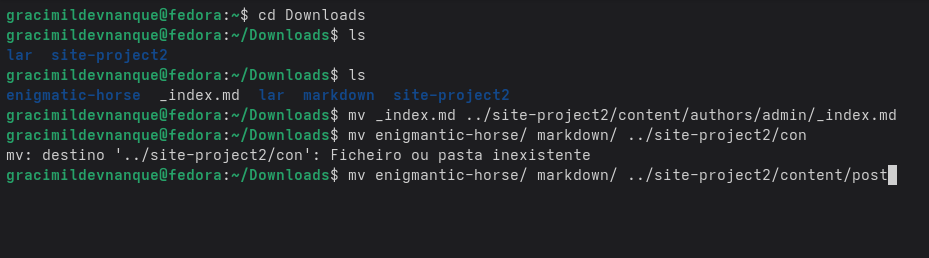
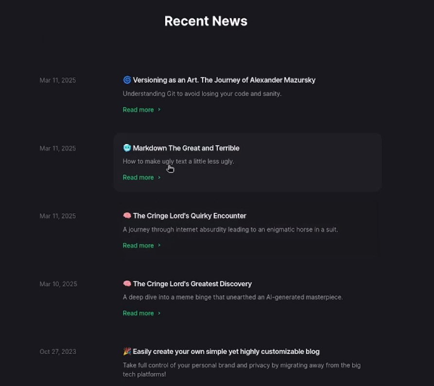
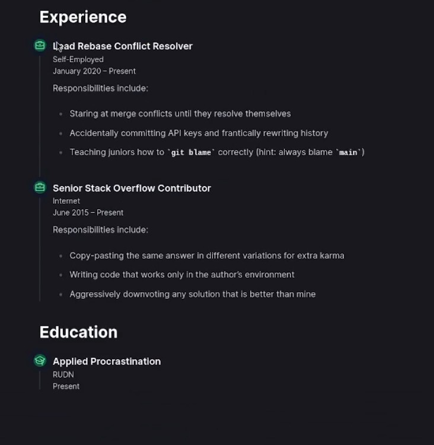

---
## Front matter
lang: ru-RU
title: Индивидуальный проект 3 этап
subtitle: Операционные системы
author:
  - Маркеш В.Н.Грасимилде.
institute:
  - Российский университет дружбы народов, Москва, Россия
date: 11 Апреля 2026

## i18n babel
babel-lang: russian
babel-otherlangs: english

## Formatting pdf
toc: false
toc-title: Содержание
slide_level: 2
aspectratio: 169
section-titles: true
theme: metropolis
header-includes:
 - \metroset{progressbar=frametitle,sectionpage=progressbar,numbering=fraction}
---

# Информация

## Докладчик

  * Маркеш Виейра Нанке Грасимилде
  * Студент НКАбд-05-25
  * Я Виейра
  * Российский университет дружбы народов
  * 1032255356@rudn.ru

## Цель работы

Продолжить работу с сайтом, добавить личные достижения

## Задание

1. Добавить информацию о навыках (Skills).
2. Добавить информацию об опыте (Experience).
3. Добавить информацию о достижениях (Accomplishments).
4. Сделать пост по прошедшей неделе.
5. Добавить пост на тему по выбору: Легковесные языки разметки. Языки разметки. LaTeX. Язык разметки Markdown.

## Выполнение индивидуального проекта

Переношу изменный файл с достижениям и два новых поста в директорию с сайтом. 

{#fig:001 width=70%}

##

Проверяю отображение двух новых постов на сайте. 

{#fig:002 width=70%}

##

Проверяю отображение своих достижений на сайте. 

{#fig:003 width=70%}

## Выводы

Мы продолжили работу с сайтом, добавили личные достижения.
