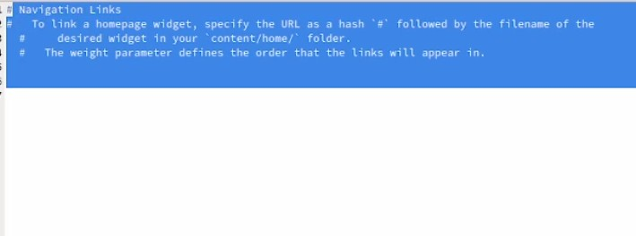
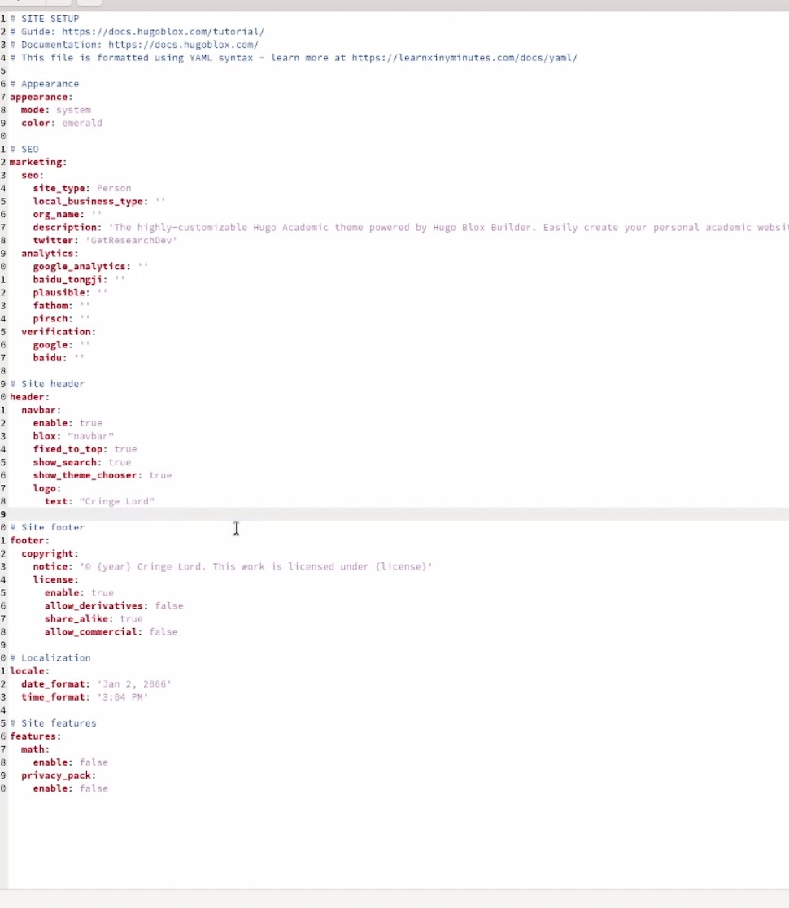
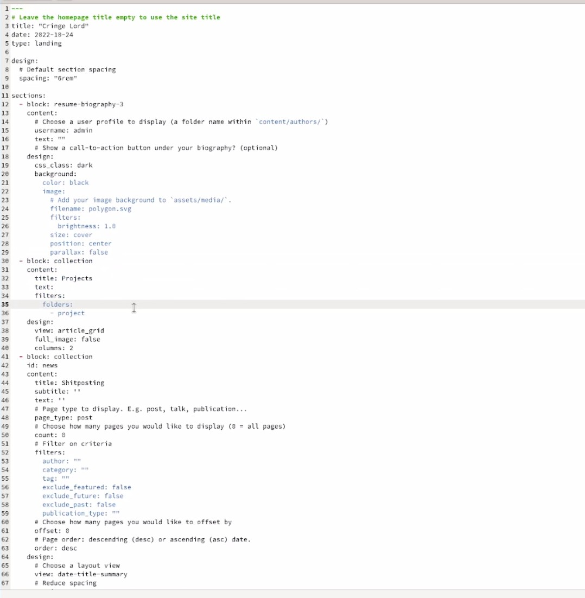
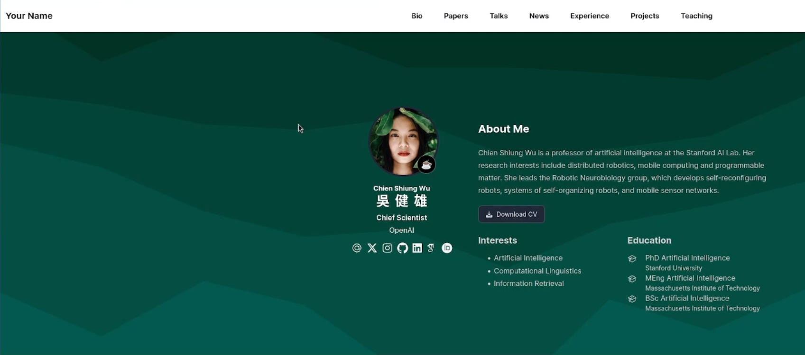

---
## Front matter
lang: ru-RU
title: Индивидуальный проект 5 этап
subtitle: Операционные системы
author:
  - Маркеш В.Н Грасимилде.
institute:
  - Российский университет дружбы народов, Москва, Россия
date: 06 марта 2025

## i18n babel
babel-lang: russian
babel-otherlangs: english

## Formatting pdf
toc: false
toc-title: Содержание
slide_level: 2
aspectratio: 169
section-titles: true
theme: metropolis
header-includes:
 - \metroset{progressbar=frametitle,sectionpage=progressbar,numbering=fraction}
---

# Информация

## Докладчик

  * Маркеш Виейра Нанке Грасимилде
  * Студент НКАбд-05-25
  * я Виейра 
  * Российский университет дружбы народов
  * 1032255356@rudn.ru

## Цель работы

Продолжить работу с сайтом, добавить к сайту записи для персональных проектов, сделать пост по прошлой неделе и по языкам научного программирования.

## Задание

1. Сделать записи для персональных проектов.
2. Сделать пост по прошедшей неделе.
3. Добавить пост на тему по выбору. Языки научного программирования.

## Выполнение индивидуального проекта

Удлаяю меню из сайта 

{#fig:001 width=70%}

##

Меняю параметры сайта 

{#fig:002 width=70%}

##

Меняю главную страницу сайта 

{#fig:003 width=70%}

##

Проверяю отображение на сайте. 

{#fig:004 width=70%}

## Выводы

Мы продолжили работу с сайтом, добавили к сайту записи для индивидуального проекта, сделали пост по выбору и по прошедшей неделе.
